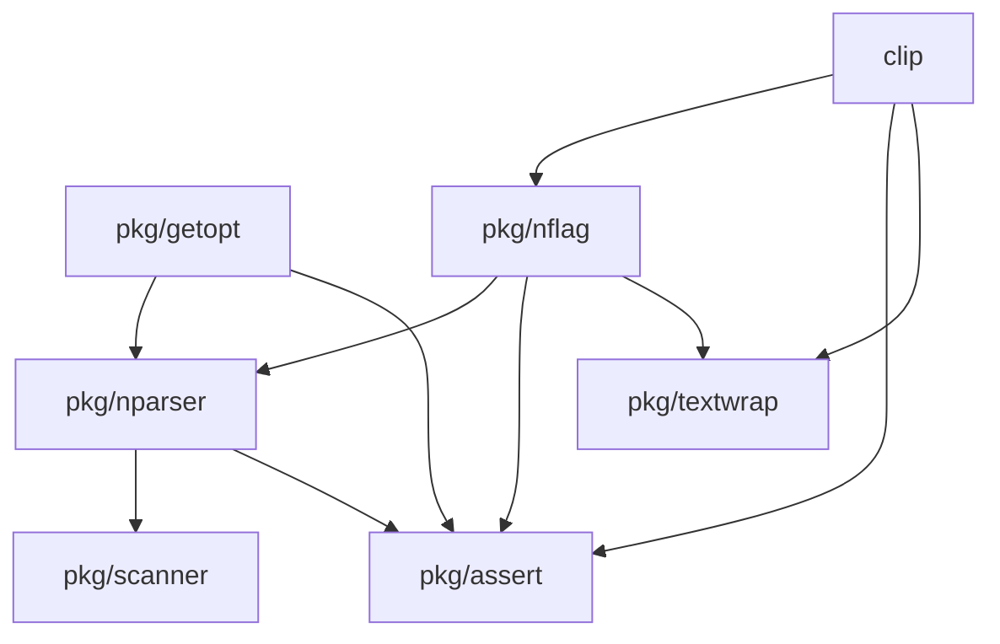

# clip: Command Line Parser

[](https://pkg.go.dev/github.com/bassosimone/clip) [](https://github.com/bassosimone/clip/actions) [](https://codecov.io/gh/bassosimone/clip)

Clip is a flexible command line parser written in Go.

## Features

1. Intuitive flag parsing API modeled after the standard
library's [flag](https://pkg.go.dev/flag) package.

2. Support for (possibly nested) subcommands.

3. Automatic handling of help generation.

4. Optional handling of printing version information.

5. [GNU getopt](https://linux.die.net/man/3/getopt) compatible defaults:

    - Short options introduced by `-`, long options introduced by `--`.

    - The ability to mix short and long options.

    - Automatic (but configurable) options and arguments permutation.

    - The `--` separator to terminate options processing.

6. Customizable option prefixes for short and long flags,
allowing to implement subcommands that emulate different command
line tools' flag parsing styles (e.g., using `+` to introduce
long options, like in the [dig](https://linux.die.net/man/1/dig)).

## Use Cases

The main use case for this package is to implement command line
tools that require a flexible command line parser designed to
handle subcommands with distinct parsing styles.

For example, the [rbmk](https://github.com/rbmk-project/rbmk) network
measurement tool includes, among other subcommands, a `curl` subcommand
emulating [curl](https://linux.die.net/man/1/curl) and using the GNU
parsing style and a `dig` subcommand emulating [dig](https://linux.die.net/man/1/dig),
which uses `dig`-style flag parsing.

Therefore, `rbmk` needs to parse the following command lines:

```bash
# Using curl-like parsing style
rbmk curl -X GET --header "Accept: application/json" https://api.example.com/resource

# Using dig-like parsing style
rbmk dig +short example.com @8.8.4.4 IN A
```

And [clip](.) provides the necessary functionality to implement that. In fact,
[clip] is derived from code originally written for `rbmk`.

## Main Concepts

1. **clip/pkg/nflag.FlagSet**: parses command-line arguments
using an API similar to the standard library’s [flag](https://pkg.go.dev/flag)
package. It supports both short and long options, positional arguments,
and automatic help generation. You can configure option
prefixes (e.g., `-`, `--`, `+`, `/`) per flag.

2. **clip.RootCommand**: the root command of your CLI application.

3. **clip.DispatcherCommand**: a command that dispatches to
subcommands. It can be used to implement a top-level command
that handles subcommands, like `git`, or `docker`.

4. **clip.LeafCommand**: a command that does not have subcommands
and should parse flags using a **FlagSet**.

The **RootCommand**, **DispatcherCommand**, and **LeafCommand** are
generic over an **ExecEnv** type, which is an environment mocking
selected standard library I/O functions, such as `os.Stdout`, `os.Stderr`,
thus facilitating writing unit tests for your commands.

## Examples

The following example shows how to create subcommands and parse flags using
[clip](.) and [pkg/nflag](./pkg/nflag):

```Go
package main

import (
	"context"
	"fmt"
	"math"

	"github.com/bassosimone/clip"
	"github.com/bassosimone/pkg/assert"
	"github.com/bassosimone/pkg/nflag"
)

// toolVersion is the version of the tool we're implementing.
const toolVersion = "0.1.0"

// Define a tar-like subcommand for archiving files.
var tarSubcommand = &clip.LeafCommand[*clip.StdlibExecEnv]{
	BriefDescriptionText: "Archiving utility.",

	// The parent needs to know how to get the help for this leaf command
	// so that `tool help tar` internally becomes `tool tar --help`.
	HelpFlagValue: "--help",

	RunFunc: func(
		ctx context.Context, args *clip.CommandArgs[*clip.StdlibExecEnv]) error {

		// Create command line parser
		fset := nflag.NewFlagSet(args.CommandName, nflag.ExitOnError)
		fset.Description = args.Command.BriefDescription()
		fset.PositionalArgumentsUsage = "file ..."
		fset.MinPositionalArgs = 1
		fset.MaxPositionalArgs = math.MaxInt

		// Add -c, --create flag
		cflag := fset.Bool("create", 'c', false, "create a new archive")

		// Add the -f, --file <argument> flag
		fflag := fset.String("file", 'f', "", "archive file name")

		// Add -h, --help flag, which the FlagSet will handle automatically
		fset.AutoHelp("help", 'h', "Print this help message and exit.")

		// Add -v, --verbose flag
		vflag := fset.Bool("verbose", 'v', false, "verbose mode")

		// Add -z, --gzip flag
		zflag := fset.Bool("gzip", 'z', false, "gzip compression")

		// Parse command line arguments and assert on error, which should
		// not happen since we're using nflag.ExitOnError
		assert.NotError(fset.Parse(args.Args))

		// ...
	},
}

// Define a gzip-like subcommand for compressing files.
var gzipSubcommand = &clip.LeafCommand[*clip.StdlibExecEnv]{
	BriefDescriptionText: "Compress or expand files.",
	HelpFlagValue:        "--help",
	RunFunc: func(
		ctx context.Context, args *clip.CommandArgs[*clip.StdlibExecEnv]) error {
		// ... same as above ...
	},
}

// Define a dispatcher dispatching to either the tar or gzip subcommands.
var toolsDispatcher = &clip.DispatcherCommand[*clip.StdlibExecEnv]{
	BriefDescriptionText: "UNIX command-line tools.",

	// These are the subcommands to dispatch to, indexed by name
	Commands: map[string]clip.Command[*clip.StdlibExecEnv]{
		"gzip": gzipSubcommand,
		"tar":  tarSubcommand,
	},

	// This flag means that the dispatcher calls Exit on error
	ErrorHandling: nflag.ExitOnError,

	// Setting this field enables the `--version` flag.
	Version: toolVersion,

	// Tell the dispatcher about the option prefixes we're using in the
	// whole application (we're using GNU conventions). This allows it to
	// reorder command line arguments and options in a way that this:
	//
	//	tool -czf archive.tar.gz tar file1.txt file2.txt
	//
	// is parsed and interpreted as:
	//
	//	tool tar -czf archive.tar.gz file1.txt file2.txt
	//
	// We need to know the option prefixes to know which tokens are
	// options and which, instead, are positional arguments.
	//
	// The separator between options and positional arguments is
	// `--`, which is the value used by GNU getopt. When we encounter
	// this separator, we stop processing options and treat all
	// subsequent tokens as positional arguments.
	//
	// If you do not set at least the `OptionPrefixes` field, then the
	// dispatcher will not attempt to reorder the command line.
	OptionPrefixes:            []string{"-", "--"},
	OptionsArgumentsSeparator: "--",
}

// Define a root command to wrap it all
var rootCommand = &clip.RootCommand[*clip.StdlibExecEnv]{
	Command: toolsDispatcher,
}

func main() {
	// Create environment using the standard library I/O
	env := clip.NewStdlibExecEnv()

	// Execute the root command
	rootCommand.Main(env)
}
```

The following table lists all the available, testable examples:

| Package      | Example(s)                                                                                  |
|--------------|--------------------------------------------------------------------------------------------|
| [clip](.)         | [example_test.go](example_test.go)                                                         |
| [pkg/getopt](./pkg/getopt)   | [pkg/getopt/example_test.go](pkg/getopt/example_test.go)                                   |
| [pkg/nflag](./pkg/nflag)     | [pkg/nflag/example_test.go](pkg/nflag/example_test.go)                                       |
| [pkg/nparser](./pkg/nparser)   | [pkg/nparser/example_test.go](pkg/nparser/example_test.go)                                   |
| [pkg/scanner](./pkg/scanner)  | [pkg/scanner/example_test.go](pkg/scanner/example_test.go)                                 |

The [cmd/minirbmk](./cmd/minirbmk) example shows how to integrate
[clip](https://github.com/bassosimone/clip) into a Go CLI application
using nested subcommands. In such example we also show customizing
the flag parser to parse `+flag`-like flags.

## Architecture

The following diagram illustrates the main [clip](.) packages and their dependencies:



| Package                                                                 | Docs                                                                 | Description                                                      |
|-------------------------------------------------------------------------|----------------------------------------------------------------------|------------------------------------------------------------------|
| [clip](https://github.com/bassosimone/clip)                             | [Docs](https://pkg.go.dev/github.com/bassosimone/clip)              | Top-level API integrating [./pkg/nflag](./pkg/nflag) with subcommands. |
| [pkg/getopt](https://github.com/bassosimone/clip/tree/main/pkg/getopt)  | [Docs](https://pkg.go.dev/github.com/bassosimone/clip/pkg/getopt)   | GNU getopt compatible implementation (uses the parser).           |
| [pkg/nflag](https://github.com/bassosimone/clip/tree/main/pkg/nflag)      | [Docs](https://pkg.go.dev/github.com/bassosimone/clip/pkg/nflag)     | Stdlib-inspired flag implementation (uses the parser).                  |
| [pkg/nparser](https://github.com/bassosimone/clip/tree/main/pkg/nparser)  | [Docs](https://pkg.go.dev/github.com/bassosimone/clip/pkg/nparser)   | Parser for CLI options (uses the scanner).                       |
| [pkg/scanner](https://github.com/bassosimone/clip/tree/main/pkg/scanner)| [Docs](https://pkg.go.dev/github.com/bassosimone/clip/pkg/scanner)  | Scanner for CLI options.                                         |
| [pkg/textwrap](https://github.com/bassosimone/clip/tree/main/pkg/textwrap)| [Docs](https://pkg.go.dev/github.com/bassosimone/clip/pkg/textwrap) | Utility code to wrap and indent text.                            |
| [pkg/assert](https://github.com/bassosimone/clip/tree/main/pkg/assert)  | [Docs](https://pkg.go.dev/github.com/bassosimone/clip/pkg/assert)   | Code to write runtime assertions that panic in case of failure.   |

## Documentation

Read the package documentation at [pkg.go.dev/github.com/bassosimone/clip](https://pkg.go.dev/github.com/bassosimone/clip).

## Minimum Supported Go Version

Go 1.24

## Installation

```bash
go get -u -v github.com/bassosimone/clip
```

## API Stability Guarantees

This package is experimental and the API may change in the future. Yet,
we will not anticipate breaking the existing API without a compelling reason
to do so (e.g., bugs or significant design flaws).

## Running Tests

```
go test -race -count 1 -cover ./...
```

## Dependencies

- [github.com/google/go-cmp](https://pkg.go.dev/github.com/google/go-cmp)
for improving the comparison of structs in unit tests.

- [github.com/kballard/go-shellquote](https://pkg.go.dev/github.com/kballard/go-shellquote)
for quoting command line arguments in error messages.

## License

```
SPDX-License-Identifier: GPL-3.0-or-later
```
